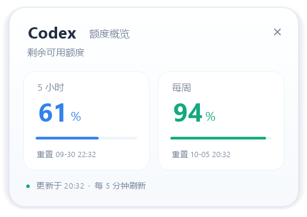

# Codex Quota Rings

Windows 任务栏上的透明 Codex 额度双圆环。一眼查看 **5 小时**与**每周剩余额度**，无需展开 Codex。

Lightweight, transparent Windows taskbar rings for your remaining Codex 5-hour and weekly quotas. Built with C# and Windows Forms, without Electron or WebView.




> 这是独立的社区工具，与 OpenAI 无隶属关系。界面当前为中文。预览使用模拟数据。

## 功能

- 透明双圆环显示剩余百分比：`5h` 为 5 小时，`7d` 为每周。
- 直接覆盖显示在主任务栏空白区域，不会随托盘图标折叠。
- 悬停圆环自动浮现额度卡片；离开圆环及卡片后自动收起，不抢焦点、不产生额外任务栏图标。
- 窗口切换及任务栏预览时保持圆环显示；任务栏短暂移出屏幕时保留原位置。
- Exp 下方的小刷新按钮直接查询；默认每 5 分钟自动刷新。
- 横向拖动定位、浅色/深色主题适配、DPI 缩放、可选开机启动。
- 可手动填写 `Exp` 会员到期日，日期保存在本机。
- 完全退出 Codex 桌面程序后，圆环独立运行，仍可自动刷新和手动查询。
- 启动时恢复上次成功的额度读数；离线或登录失效时以灰色标记旧数据与查询时间。

## 下载与运行

从 [Releases](https://github.com/VincentZ-gd/codex-quota-rings/releases) 下载最新的 Windows 压缩包，完整解压后双击 `CodexQuotaRings.exe`。

下载包与 SHA-256 校验值见对应 Release。Release 下载包由 GitHub Actions 构建。

要求：Windows 10/11、.NET Framework 4.6 或更新版本，以及支持 `app-server` 且已使用 ChatGPT 账号登录的 Codex CLI。本机验证环境为 Windows 11；其他任务栏布局尚未全面验证。

程序依次查找 `CODEX_QUOTA_CODEX_EXE` 环境变量、PATH 中的 `codex.exe`、桌面版安装的 `%LOCALAPPDATA%\OpenAI\Codex\bin` 下的 `codex.exe`。若你的 CLI 安装方式不同，请把 `CODEX_QUOTA_CODEX_EXE` 设置为实际的 **codex.exe** 完整路径，然后重启本工具。仅有 API Key 的登录方式可能没有 ChatGPT 套餐额度。

### 可选：安装及开机启动

先退出已运行的圆环，在解压目录打开 PowerShell：

```powershell
powershell.exe -NoProfile -ExecutionPolicy Bypass -File .\install.ps1
```

安装脚本将程序复制到 `%LOCALAPPDATA%\Programs\CodexQuotaRings`，并为当前用户启用开机启动。也可以绿色运行后右键圆环勾选“开机启动”；此时请保持程序路径不变。

### 操作

| 操作 | 效果 |
| --- | --- |
| 悬停圆环 | 约 0.2 秒后展开详情；移开约 0.28 秒后收起 |
| 移入卡片 / 点击圆环 | 保持显示 / 立即查看详情 |
| 点击 Exp 下方回转箭头 | 立即刷新；查询中显示省略号 |
| 拖动圆环 | 调整横向位置 |
| 右键圆环 | 刷新、设置 Exp、开机启动、恢复位置、退出 |
| 点击卡片 × | 收起详情，重新移入圆环可再次展开 |

## 查询方式与隐私

本工具启动一个短时运行的 `codex app-server --listen stdio://` 进程，只发送初始化和 `account/rateLimits/read` 请求。它不创建模型会话、不发送推理请求，因此查询本身不使用模型推理额度。它仍会发起经过 CLI 认证的网络请求，服务端可能实施请求频率限制。协议说明见 [OpenAI Codex App Server 文档](https://learn.chatgpt.com/docs/app-server)。

认证由官方 CLI 处理。本工具不直接读取或保存账号令牌、浏览器 Cookie 或 API Key，无遥测、无自动上传功能。

### 关闭 Codex 后继续查询

圆环是独立的 Windows 进程。每次刷新自行启动官方 CLI、读取额度并关闭查询子进程，两次刷新之间不常驻 CLI。后台查询明确传入 Windows 用户目录及 Codex 配置目录，并从用户目录启动，避免依赖桌面程序的运行环境或项目配置。

关闭 Codex 桌面程序不会删除其 CLI 文件和已保存的登录，因此圆环可以继续查询。需要保持本机登录有效、网络可用，并让圆环继续运行。勾选右键菜单中的“开机启动”可在下次登录 Windows 后自动启动圆环。**退出登录**会使查询失效；**卸载 Codex**可能移除 CLI，这时需另外安装官方 CLI 并设置其路径。无需为额度查询开通 API Key。

官方登录若设置为仅存内存的 `ephemeral` 模式，独立查询无法复用桌面进程的登录。需使用官方 CLI 支持的持久登录方式，见 [官方认证文档](https://learn.chatgpt.com/docs/auth)。

本地数据：

- `%LOCALAPPDATA%\CodexQuotaRings\status.json`：最近的额度读数、更新时间、Exp 和显示位置，用于本地诊断；不包含认证凭据。
- `%LOCALAPPDATA%\CodexQuotaRings\quota-cache.json`：上次成功查询的额度与时间，重启后先显示为旧数据。缓存不包含凭据，不代表实时额度；账号切换后，以新查询结果为准。
- `%LOCALAPPDATA%\CodexQuotaRings\cli-state`：额度查询子进程的 SQLite 运行状态。使用官方 `CODEX_SQLITE_HOME` 设置；若用户已显式配置该环境变量或 `sqlite_home`，则遵循其设置。
- `HKCU\Software\CodexQuotaRings`：横向位置和手动填写的 Exp。
- 启用开机启动时，在当前用户的 `Run` 注册表项中保存启动路径。

请勿在公开问题报告中上传自己的认证文件或未经检查的诊断信息。

## Exp 与数据含义

Exp 是**手动记录**的日期，不会自动续期，也不会跟随账号切换。尚未填写时显示“未设置”。在设置窗口取消日期前的勾选即可清除。

目前查阅的官方公开账号及额度接口没有提供会员到期日字段。`resetsAt` 是额度重置时间；额度重置奖励中的 `expiresAt` 是奖励有效期，不能用于推算会员到期日。自动续费的下一次扣款日也不等同于会员终止日期。

圆环显示的是**剩余**额度。灰色表示启动恢复的缓存或查询失败后保留的旧读数；横线表示暂无对应窗口数据。查询失败的前三次重试间隔为 30 秒，之后恢复 5 分钟。缓存中的重置时间到达后，不会自行假定额度已恢复，必须以新查询结果为准。

## 已知限制

- 以透明子窗口挂在 Explorer 任务栏上，减少普通窗口最小化和显示桌面动画对圆环的影响；未使用 DeskBand，也不会为其他应用图标预留空间，有重叠时请手动拖动。系统拒绝挂载时使用独立置顶窗口兼容模式。
- 主要面向主显示器底部的水平任务栏。多显示器、垂直任务栏及其他 Shell 未完整测试。
- 挂载模式下圆环随任务栏一起自动隐藏。兼容模式下，任务栏持续隐藏超过 2 秒后圆环隐藏。
- 需要有效的 Codex 登录和网络连接；登录失效时，请在 Codex 中重新登录。
- 实测单次常驻工作集约 49 MB，具体随系统变化；刷新期间 CLI 子进程会额外占用内存。
- 发布文件尚未进行代码签名。

## 从源码构建

使用 Windows 自带 .NET Framework C# 编译器，无需 NuGet：

```powershell
powershell.exe -NoProfile -ExecutionPolicy Bypass -File .\build.ps1
```

脚本构建 GUI 程序，运行额度解析、悬停交互、独立后台查询、缓存和任务栏定位自检，并生成 `dist\CodexQuotaRings-v2.5.2-windows.zip` 及 `SHA256SUMS.txt`。自检使用严格只允许初始化与额度查询的模拟 CLI，不需要登录或网络。窗口检查验证原生置顶、非激活属性、DWM 接受 Peek 排除设置，以及任务栏过渡与自动隐藏恢复。

`src/CodexQuotaRings.cs` 负责 CLI 查询、解析及菜单；`src/TaskbarView.cs` 负责绘图、任务栏定位和详情窗口。

## 卸载

先右键取消“开机启动”，再选择“退出”，删除解压目录或安装目录即可。若需清除本地数据，可自行删除上述状态目录及 `HKCU\Software\CodexQuotaRings` 设置项。卸载不影响 Codex 登录。

## 反馈与许可证

欢迎通过本仓库 Issues 提交问题，附上 Windows 版本、缩放比例、任务栏布局及复现步骤。项目以 [MIT License](LICENSE) 发布。
